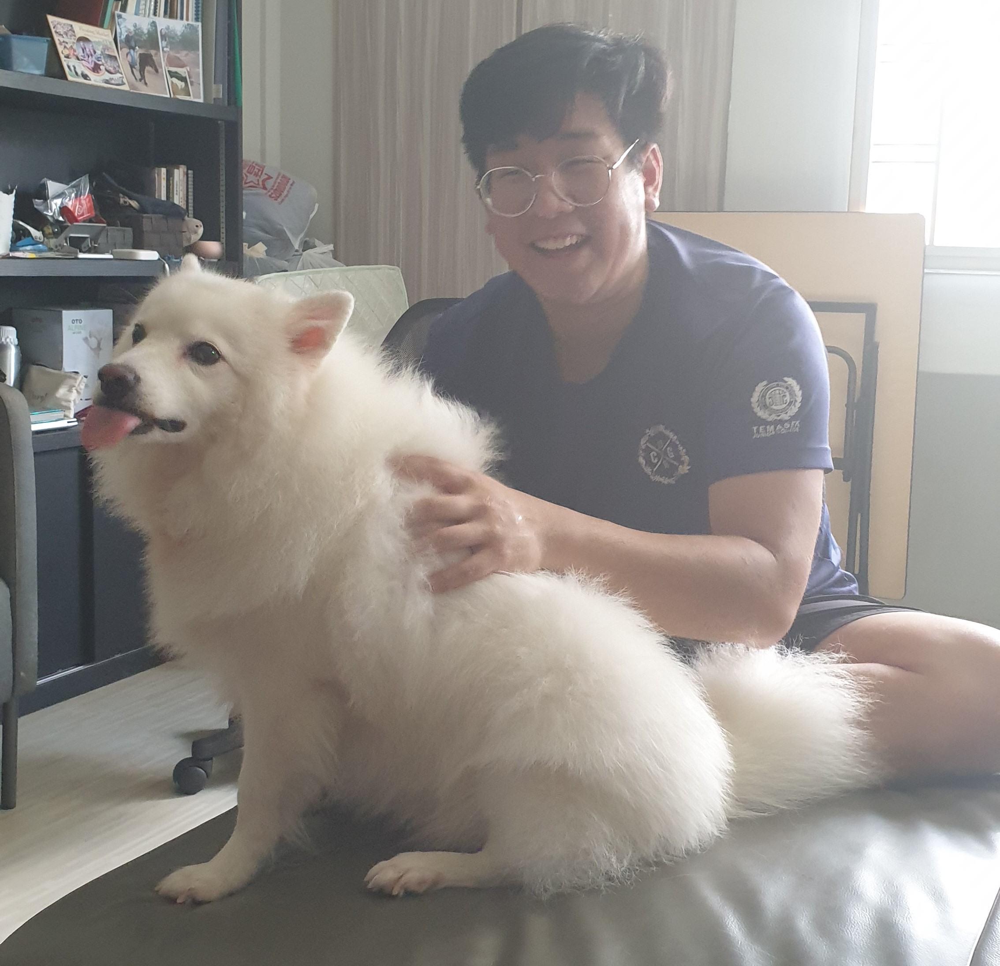
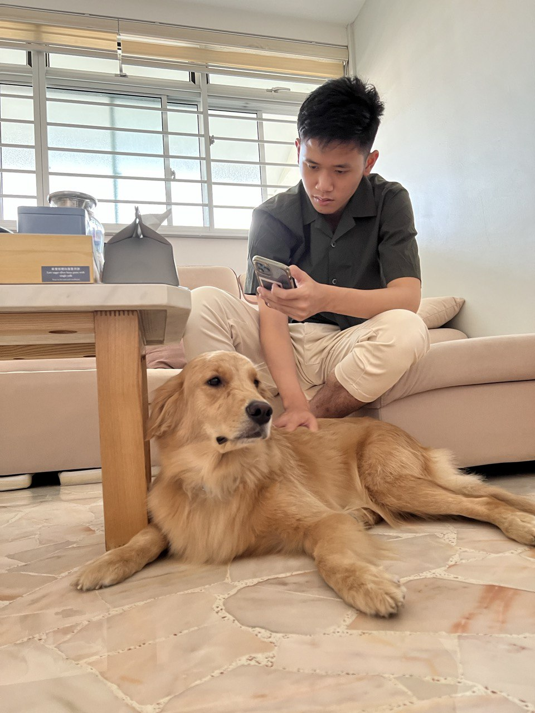

We are a team based in the [School of Computing, National University of Singapore](http://www.comp.nus.edu.sg).

You can reach us at the email `seer[at]comp.nus.edu.sg`

## Project team

### Althea Chua

[[github](https://github.com/chuababyy)]
[[portfolio](team/chuababyy.md)]

* Role: Developer

### Chow Yuan Jing

[[github](http://github.com/seewhyjay)]
[[portfolio](team/chowyuanjing.md)]

* Role: Developer
* Responsibilities: Integration

### Jia Rong

[[github](http://github.com/jrchoo)] [[portfolio](https://nus-cs2103-ay2324s1.github.io/tp-dashboard/?search=jrchoo&breakdown=true)]

* Role: Developer
* Responsibilities: Data

### Terrence

[[github](https://github.com/Badatprogrammiing)]
[[portfolio](team/badatprogrammiing.md)]

* Role: Developer
* Responsibilities: Dev Ops + Threading

### Htet Wai Yan Aung

[[github](http://github.com/jellywaiyan)]
[[portfolio](team/jellywaiyan.md)]

* Role: Developer
* Responsibilities: Testing
