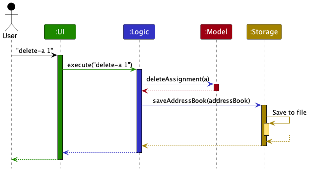
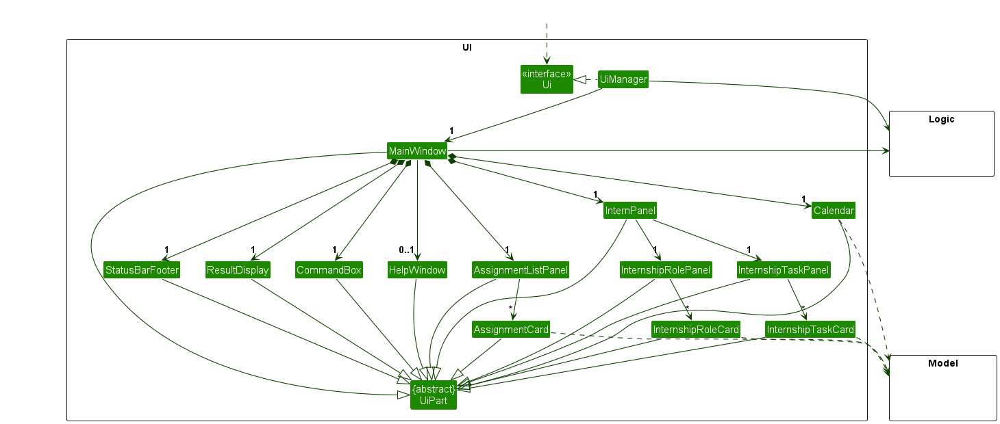
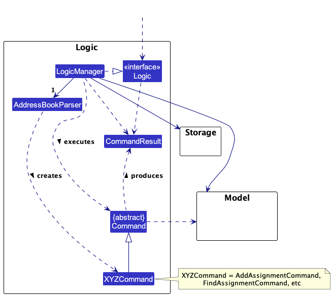
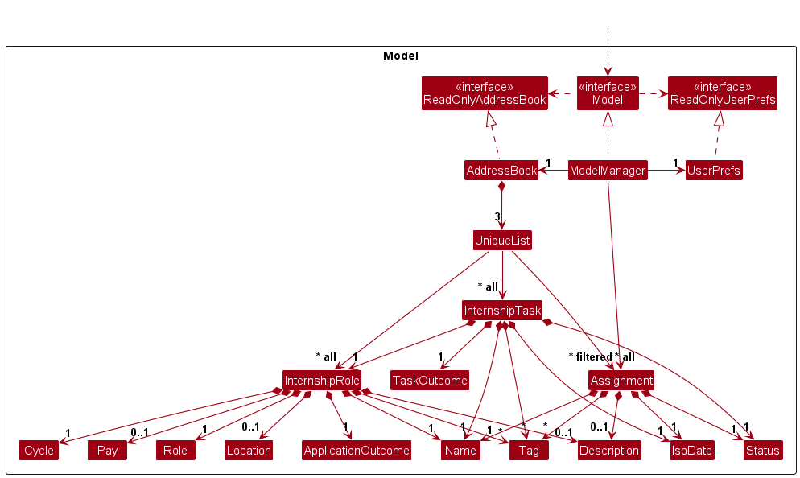
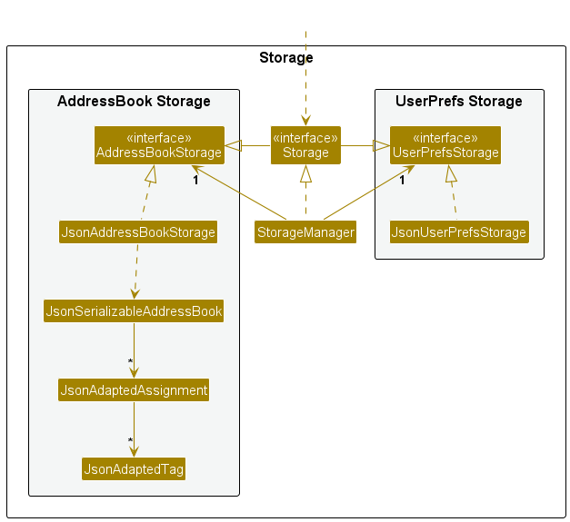

* Table of Contents
{:toc}

--------------------------------------------------------------------------------------------------------------------

## **Acknowledgements**

* {list here sources of all reused/adapted ideas, code, documentation, and third-party libraries -- include links to the original source as well}

--------------------------------------------------------------------------------------------------------------------

## **Setting up, getting started**

Refer to the guide [_Setting up and getting started_](SettingUp.md).

--------------------------------------------------------------------------------------------------------------------

## **Design**

:bulb: **Tip:** The `.puml` files used to create diagrams in this document `docs/diagrams` folder. Refer to the [_PlantUML Tutorial_ at se-edu/guides](https://se-education.org/guides/tutorials/plantUml.html) to learn how to create and edit diagrams.

### Architecture

The ***Architecture Diagram*** given above explains the high-level design of the App.

Given below is a quick overview of main components and how they interact with each other.

**Main components of the architecture**

**`Main`** (consisting of classes [`Main`](https://github.com/se-edu/addressbook-level3/tree/master/src/main/java/seedu/address/Main.java) and [`MainApp`](https://github.com/se-edu/addressbook-level3/tree/master/src/main/java/seedu/address/MainApp.java)) is in charge of the app launch and shut down.
* At app launch, it initializes the other components in the correct sequence, and connects them up with each other.
* At shut down, it shuts down the other components and invokes cleanup methods where necessary.

The bulk of the app's work is done by the following four components:

* [**`UI`**](#ui-component): The UI of the App.
* [**`Logic`**](#logic-component): The command executor.
* [**`Model`**](#model-component): Holds the data of the App in memory.
* [**`Storage`**](#storage-component): Reads data from, and writes data to, the hard disk.

[**`Commons`**](#common-classes) represents a collection of classes used by multiple other components.

**How the architecture components interact with each other**

The *Sequence Diagram* below shows how the components interact with each other for the scenario where the user issues the command `delete-a 1`.

Each of the four main components (also shown in the diagram above),

* defines its *API* in an `interface` with the same name as the Component.
* implements its functionality using a concrete `{Component Name}Manager` class (which follows the corresponding API `interface` mentioned in the previous point.

For example, the `Logic` component defines its API in the `Logic.java` interface and implements its functionality using the `LogicManager.java` class which follows the `Logic` interface. Other components interact with a given component through its interface rather than the concrete class (reason: to prevent outside component's being coupled to the implementation of a component), as illustrated in the (partial) class diagram below.

The sections below give more details of each component.

### UI component

The **API** of this component is specified in [`Ui.java`](https://github.com/se-edu/addressbook-level3/tree/master/src/main/java/seedu/address/ui/Ui.java)

The UI consists of a `MainWindow` that is made up of parts e.g.`CommandBox`, `ResultDisplay`, `selectedViewPanel`, `StatusBarFooter` etc. All these, including the `MainWindow`, inherit from the abstract `UiPart` class which captures the commonalities between classes that represent parts of the visible GUI.

The `UI` component uses the JavaFx UI framework. The layout of these UI parts are defined in matching `.fxml` files that are in the `src/main/resources/view` folder. For example, the layout of the [`MainWindow`](https://github.com/se-edu/addressbook-level3/tree/master/src/main/java/seedu/address/ui/MainWindow.java) is specified in [`MainWindow.fxml`](https://github.com/se-edu/addressbook-level3/tree/master/src/main/resources/view/MainWindow.fxml)

The `UI` component,

* executes user commands using the `Logic` component.
* listens for changes to `Model` data so that the UI can be updated with the modified data.
* keeps a reference to the `Logic` component, because the `UI` relies on the `Logic` to execute commands.
* depends on some classes in the `Model` component, as it displays `Person` object residing in the `Model`.

The Storage component is responsible for the following key features:

***View Changes***

* Listen for different view changes, using the respective inputs when users call the respective list commands
* Update the UI accordingly to display the selected view

***Calendar***

* Whenever a user performs an add, or delete operation, update the names of the tasks in the calendar accordingly
* Switching between different calendar months using buttons

### Logic component

**API** : [`Logic.java`](https://github.com/se-edu/addressbook-level3/tree/master/src/main/java/seedu/address/logic/Logic.java)

Here's a (partial) class diagram of the `Logic` component:

How the `Logic` component works:

1. When `Logic` is called upon to execute a command, it is passed to an `AddressBookParser` object which in turn creates a parser that matches the command (e.g., `AddAssignmentCommandParser`) and uses it to parse the command.
1. This results in a `Command` object (more precisely, an object of one of its subclasses e.g., `AddAssignmentCommand`) which is executed by the `LogicManager`.
1. The command can communicate with the `Model` when it is executed (e.g. to add an assignment).
1. The result of the command execution is encapsulated as a `CommandResult` object which is returned back from `Logic`.

The sequence diagram below illustrates the interactions within the `Logic` component, taking `execute("delete 1")` API call as an example.

:information_source: **Note:** The lifeline for `DeleteAssignmentCommandParser` should end at the destroy marker (X) but due to a limitation of PlantUML, the lifeline reaches the end of diagram.

Here are the other classes in `Logic` (omitted from the class diagram above) that are used for parsing a user command:

How the parsing works:
* When called upon to parse a user command, the `AddressBookParser` class creates an `XYZCommandParser` (`XYZ` is a placeholder for the specific command name e.g., `AddAssignmentCommandParser`) which uses the other classes shown above to parse the user command and create a `XYZCommand` object (e.g., `AddAssignmentCommand`) which the `AddressBookParser` returns back as a `Command` object.
* All `XYZCommandParser` classes (e.g., `AddAssignmentCommandParser`, `DeleteAssignmentCommandParser`, ...) inherit from the `Parser` interface so that they can be treated similarly where possible e.g, during testing.

### Model component
**API** : [`Model.java`](https://github.com/se-edu/addressbook-level3/tree/master/src/main/java/seedu/address/model/Model.java)

The `Assignment` component,

* stores the address book data i.e., all `Assignment` objects (which are contained in a `UniqueList` object).
* stores the currently 'selected' `Assignment` objects (e.g., results of a search query) as a separate _filtered_ list which is exposed to outsiders as an unmodifiable `ObservableList<Assignment>` that can be 'observed' e.g. the UI can be bound to this list so that the UI automatically updates when the data in the list change.
* stores a `UserPref` object that represents the user’s preferences. This is exposed to the outside as a `ReadOnlyUserPref` objects.
* does not depend on any of the other three components (as the `Assignment` represents data entities of the domain, they should make sense on their own without depending on other components)

### Storage component

**API** : [`Storage.java`](https://github.com/se-edu/addressbook-level3/tree/master/src/main/java/seedu/address/storage/Storage.java)

The `Storage` component plays a crucial role in your application by handling the persistence of data, specifically address book data and user preference data, in JSON format. It provides methods to save this data and retrieve it, converting it into corresponding objects when needed. This section will provide an overview of the Storage component, its key features, dependencies, and the classes it interacts with.

The Storage component is responsible for the following key features:

* Data Serialization: It can save data, such as address book entries and user preferences, in JSON format. Serialization is the process of converting these data objects into a structured text format, making them suitable for storage and future retrieval.

* Data Deserialization: It can read data back from the storage, deserialize it, and recreate corresponding objects. This feature is essential for restoring the application's state from previously saved data.

* Inheritance from AddressBookStorage and UserPrefStorage: The Storage component is designed to be versatile. It inherits from both AddressBookStorage and UserPrefStorage, allowing it to be treated as either one, depending on whether you need to work with address book data or user preference data. This inheritance simplifies the codebase by providing a single entry point for storage operations, regardless of the data type.

**Dependencies**

The Storage component relies on certain classes from the Model component, as its primary responsibility is to manage the persistence of objects that belong to the model. Currently, these classes include:

* JsonAdaptedAssignment: This class is used to store assignment data in a format suitable for JSON serialization. It is essential for saving and retrieving assignment-related information.

* JsonAdaptedInternshipRole: To store internship role data. This class ensures that internship roles can be saved and restored accurately.

* JsonAdaptedInternshipTask: This class handles the serialization and deserialization of internship task data. It is crucial for maintaining the integrity of internship-related information.

These dependencies illustrate the close relationship between the Storage and Model components, as the Storage component is responsible for managing the persistence of data associated with the Model.

### Common classes

Classes used by multiple components are in the `seedu.addressbook.commons` package.

--------------------------------------------------------------------------------------------------------------------

## **Implementation**

This section describes some noteworthy details on how certain features are implemented.

### \[Proposed\] Undo/redo feature

#### Proposed Implementation

The proposed undo/redo mechanism is facilitated by `VersionedAddressBook`. It extends `AddressBook` with an undo/redo history, stored internally as an `addressBookStateList` and `currentStatePointer`. Additionally, it implements the following operations:

* `VersionedAddressBook#commit()` — Saves the current address book state in its history.
* `VersionedAddressBook#undo()` — Restores the previous address book state from its history.
* `VersionedAddressBook#redo()` — Restores a previously undone address book state from its history.

These operations are exposed in the `Model` interface as `Model#commitAddressBook()`, `Model#undoAddressBook()` and `Model#redoAddressBook()` respectively.

Given below is an example usage scenario and how the undo/redo mechanism behaves at each step.

Step 1. The user launches the application for the first time. The `VersionedAddressBook` will be initialized with the initial address book state, and the `currentStatePointer` pointing to that single address book state.

Step 2. The user executes `delete 5` command to delete the 5th person in the address book. The `delete` command calls `Model#commitAddressBook()`, causing the modified state of the address book after the `delete 5` command executes to be saved in the `addressBookStateList`, and the `currentStatePointer` is shifted to the newly inserted address book state.

Step 3. The user executes `add n/David …​` to add a new person. The `add` command also calls `Model#commitAddressBook()`, causing another modified address book state to be saved into the `addressBookStateList`.

:information_source: **Note:** If a command fails its execution, it will not call `Model#commitAddressBook()`, so the address book state will not be saved into the `addressBookStateList`.

Step 4. The user now decides that adding the person was a mistake, and decides to undo that action by executing the `undo` command. The `undo` command will call `Model#undoAddressBook()`, which will shift the `currentStatePointer` once to the left, pointing it to the previous address book state, and restores the address book to that state.

:information_source: **Note:** If the `currentStatePointer` is at index 0, pointing to the initial AddressBook state, then there are no previous AddressBook states to restore. The `undo` command uses `Model#canUndoAddressBook()` to check if this is the case. If so, it will return an error to the user rather
than attempting to perform the undo.

The following sequence diagram shows how the undo operation works:

:information_source: **Note:** The lifeline for `UndoCommand` should end at the destroy marker (X) but due to a limitation of PlantUML, the lifeline reaches the end of diagram.

The `redo` command does the opposite — it calls `Model#redoAddressBook()`, which shifts the `currentStatePointer` once to the right, pointing to the previously undone state, and restores the address book to that state.

:information_source: **Note:** If the `currentStatePointer` is at index `addressBookStateList.size() - 1`, pointing to the latest address book state, then there are no undone AddressBook states to restore. The `redo` command uses `Model#canRedoAddressBook()` to check if this is the case. If so, it will return an error to the user rather than attempting to perform the redo.

Step 5. The user then decides to execute the command `list`. Commands that do not modify the address book, such as `list`, will usually not call `Model#commitAddressBook()`, `Model#undoAddressBook()` or `Model#redoAddressBook()`. Thus, the `addressBookStateList` remains unchanged.

Step 6. The user executes `clear`, which calls `Model#commitAddressBook()`. Since the `currentStatePointer` is not pointing at the end of the `addressBookStateList`, all address book states after the `currentStatePointer` will be purged. Reason: It no longer makes sense to redo the `add n/David …​` command. This is the behavior that most modern desktop applications follow.

The following activity diagram summarizes what happens when a user executes a new command:

#### Design considerations:

**Aspect: How undo & redo executes:**

* **Alternative 1 (current choice):** Saves the entire address book.
  * Pros: Easy to implement.
  * Cons: May have performance issues in terms of memory usage.

* **Alternative 2:** Individual command knows how to undo/redo by
  itself.
  * Pros: Will use less memory (e.g. for `delete`, just save the person being deleted).
  * Cons: We must ensure that the implementation of each individual command are correct.

_{more aspects and alternatives to be added}_

### \[Proposed\] Data archiving

_{Explain here how the data archiving feature will be implemented}_

--------------------------------------------------------------------------------------------------------------------

## **Documentation, logging, testing, configuration, dev-ops**

* [Documentation guide](Documentation.md)
* [Testing guide](Testing.md)
* [Logging guide](Logging.md)
* [Configuration guide](Configuration.md)
* [DevOps guide](DevOps.md)

--------------------------------------------------------------------------------------------------------------------

## **Appendix: Requirements**

### Product scope

**Target user profile**:

* has many assignments to keep track of as a student in university
* is someone who is applying for computer science related internship roles, and will have many rounds of interview before potentially getting an offer
* prefer desktop apps over other types
* can type fast
* prefers typing to mouse interactions
* is reasonably comfortable using CLI apps

**Value proposition**: manage assignments deadlines and internship applications faster than a typical mouse/GUI driven app

### User stories

In the table below, **_user_** refers to the Computer Science student.

Priorities: High (must have) - `* * *`, Medium (nice to have) - `* *`, Low (unlikely to have) - `*`

| Priority | As a …​                                | I want to …​                                                                                                                                            | So that I can…​                                                                                                                   |
|----------|----------------------------------------|---------------------------------------------------------------------------------------------------------------------------------------------------------|-----------------------------------------------------------------------------------------------------------------------------------|
| `* * *`  | new user                               | see usage instructions                                                                                                                                  | refer to instructions when I forget how to use the App                                                                            |
| `* * *`  | user                                   | add a new assignment                                                                                                                                    | keep track of the assignments that I need to complete                                                                             |
| `* * *`  | user                                   | see the status and the deadline of my assignments                                                                                                       | monitor my progress and plan my time based on the number of tasks that needs to be completed                                      |
| `* * *`  | user                                   | delete an assignment                                                                                                                                    | remove entries that I no longer need to track                                                                                     |
| `* * *`  | user                                   | mark an assignment as completed                                                                                                                         | track my progress of my assignments, and plan my time better                                                                      |
| `* * *`  | user                                   | unmark an assignment which is currently completed                                                                                                       | track my progress if I marked something wrongly without needing to delete the entry                                               |
| `* * *`  | user with many assignments             | see all the current assignments, and all their details                                                                                                  | have a understanding of how many assignments I have in total currently                                                            |
| `* * *`  | user with many assignments             | view my assignments in chronological order of the deadlines (ie, assignment with earliest deadline first)                                               | understand which assignment is due earlier, and therefore I can prioritise it                                                     |
| `* * *`  | user                                   | add information about a **role** that I am applying to such as the role name, company, salary, overall status of the application etc.                   | keep track of the roles that I have applied to                                                                                    |
| `* * *`  | user                                   | add information about the **tasks** that I have to complete for each of the roles that I have applied for such as the OA, interview 1, interview 2 etc. | keep track of the deadlines for each task related to my application at every stage                                                |
| `* * *`  | user                                   | delete information about the **role** that I have applied for                                                                                           | remove entries of roles that I no longer want to track                                                                            |
| `* * *`  | user                                   | delete information about the **tasks** related to an application                                                                                        | remove entries of tasks that I no longer want to track                                                                            |
| `* * *`  | user                                   | update the **overall outcome** of the **role** that I have applied for (eg: follow up, rejected, success)                                               | keep track of the current status of an application                                                                                |
| `* * *`  | user                                   | update the **outcome** of a **task** related to an application (eg: follow up, rejected, pending)                                                       | keep track of the outcome of completing that task                                                                                 |
| `* * *`  | user                                   | mark the **status** of a **task** related to an application to "complete"                                                                               | keep track of which task I have completed and not miss any deadlines related to my application                                    |
| `* * *`  | user                                   | unmark the **status** of a **task** related to an application to "incomplete"                                                                           | easily change the status of the task, in case I marked it as complete wrongly                                                     |
| `* * *`  | user                                   | see **all** the **roles** which I have applied for, and the information related to each role                                                            | have an overview of each application's information and outcome                                                                    |
| `* * *`  | user                                   | see **all** the **tasks** which I have for all the roles I have applied for                                                                             | have an overview of all the tasks which I currently have, and their status, deadline and outcome                                  |
| `* *`    | user with many deadlines               | calendar view which shows the task which needs to be completed by that date                                                                             | have a quick overview of the deadlines for a particular day                                                                       |
| `* *`    | user with many assignments             | filter my assignments by deadline (ie, only view assignments due within a certain time frame)                                                           | have an overview of the assignments due within a certain time frame, and I can plan ahead for busy time frames                    |
| `* *`    | user                                   | edit the description of a previously added assignment                                                                                                   | update the assignment if there were changes to the requirements, or if I want to note more information down for myself            |
| `* *`    | user                                   | find my assignments by a certain keyword only                                                                                                           | find an assignment and view its details without needing to scroll through the whole list of assignments                           |
| `* *`    | user                                   | add in information about when I plan to complete an assignment by                                                                                       | manage my time and finish assignments before their deadline                                                                       |
| `* *`    | user with many internship tasks        | filter my internship tasks deadline (ie, only view tasks due within a certain time frame)                                                               | have an overview of the internship tasks due within a certain time frame, and I can plan ahead for busy time frames               |
| `* *`    | user with many internship tasks        | find my internship application information based on certain keywords only                                                                               | find an internship role and view its associated details and tasks without needing to scroll through the whole list of internships |
| `*`      | user with many internship applications | view overall statistics for my past applications such as at which stage do I get rejected or accepted                                                   | understand which stage I need to improve on and which stage I'm stronger in                                                       |

### Use cases

For all use cases below, we assume the following unless specified otherwise

- The **System** is `CampusCompanion`
- The **Actor** is the `user`
- The following preconditions
  - The `user` has launched the `CampusCompanion` application.
Furthermore, some of the use cases are similar when manipulating **assignments**, internship **roles** and internship **tasks**. 
Therefore, to keep the developer guide concise, the use cases elaborated upon below are only detailed for assignments. 
Nonetheless, they can be extrapolated for internships roles and tasks too, without changes to the major details within the use case. 
Such associated pairs of use cases are listed in the table below.

| Assignment Use Case                   | Internship Role Use Case                | Internship Task Use Case                    |
|---------------------------------------|-----------------------------------------|---------------------------------------------|
| UC1 - Add Assignment                  | UCxx - Add Internship Role              | UCxx - Add Internship Task                  |
| UC2 - Delete Assignment               | UCxx - Delete Internship Role           | UCxx - Delete Internship Task               |
| UC3 - Mark Assignment as complete     | _Not Applicable_                        | UCxx - Mark Internship Task as complete     |
| UC4 - UnMark Assignment as incomplete | _Not Applicable_                        | UCxx - UnMark Internship Task as incomplete |
| UC5 - List Assignments                | UCxx - List Internship Role             | _Not Applicable_                            |
| UC6 - Filter Assignments by deadline  | _Not Applicable_                        | UCxx - Filter Internship Task by deadline   |
| UC7 - Edit Assignments information    | UCxx - Edit Internship Role information | UCxx - Edit Internship Task information     |
| UC8 - Find Assignment by keyword      | UCxx - Find Internship Role by keyword  | ??                                          |

**UC1: Add an assignment**

**MSS**

1.  User requests to add an assignment
2.  CampusCompanion adds the assignment and shows success message

    Use case ends.

**Extensions**

* 1a. User enters invalid command.
  * 1a1. CampusCompanion prompts user to correct the format of the command.
  * 1a2. User enters command and information to add an assignment. 
     
    Steps 1a1-1a2 are repeated until a valid add command is entered. 
     
    Use case resumes from step 2.
* 1b. CampusCompanion detects duplicate assignment entry.
  * 1b1. CampusCompanion prompts user to not enter duplicate information
  * 1b2. User re-enters command to add an assignment.
   
  Steps 1b1-1b2 are repeated until a unique entry is entered.
  Use cases resumes from step 2.

**UC2: Delete an assignment**

**MSS**

1.  User requests to list all assignments
2.  CampusCompanion shows a list of assignments with their details
3.  User requests to delete a specific assignment in the list
4.  CampusCompanion deletes the assignment

    Use case ends.

**Extensions**

* 2a. The list is empty.

  Use case ends.

* 3a. User enters invalid command.
    * 3a1. CampusCompanion prompts user to correct the format of the command.
    * 3a2. User enters command to delete an assignment.
       
      Steps 3a1-3a2 are repeated until a valid delete command is entered.
       
      Use case resumes from step 4.

* 3b. The given index is invalid.

    * 3b1. CampusCompanion prompts user that the index is invalid.
    * 3b2. User re-enters command.
       
      Steps 3b1-3b2 are repeated until a valid index is entered.
       
      Use case resumes from step 4.

**UC3: Mark an assignment**

**MSS**

1.  User requests to list all assignments
2.  CampusCompanion shows a list of assignments with their details
3.  User requests to mark a specific assignment in the list
4.  CampusCompanion marks the assignment

    Use case ends.

**Extensions**

* 2a. The list is empty.

  Use case ends.

* 3a. User enters invalid command.
    * 3a1. CampusCompanion prompts user to correct the format of the mark command.
    * 3a2. User enters command to mark an assignment.
       
      Steps 3a1-3a2 are repeated until a valid mark command is entered.
       
      Use case resumes from step 4.

* 3b. The given index is invalid.

    * 3b1. CampusCompanion prompts user that the index is invalid.
    * 3b2. User re-enters command.
       
      Steps 3b1-3b2 are repeated until a valid index is entered.
       
      Use case resumes from step 4.

**UC4: Un-mark an assignment**

**MSS**

1.  User requests to list all assignments
2.  CampusCompanion shows a list of assignments with their details
3.  User requests to unmark a specific assignment in the list
4.  CampusCompanion unmarks the assignment

    Use case ends.

**Extensions**

* 2a. The list is empty.

  Use case ends.

* 3a. User enters invalid command.
    * 3a1. CampusCompanion prompts user to correct the format of the unmark command.
    * 3a2. User enters command to unmark an assignment.
       
      Steps 3a1-3a2 are repeated until a valid unmark command is entered.
       
      Use case resumes from step 4.

* 3b. The given index is invalid.

    * 3b1. CampusCompanion prompts user that the index is invalid.
    * 3b2. User re-enters command.
       
      Steps 3b1-3b2 are repeated until a valid index is entered.
       
      Use case resumes from step 4.

**UC5 - List Assignments**

**MSS**

1.  User requests to list all assignments
2.  CampusCompanion shows a list of assignments with their details

    Use case ends.

**Extensions**

* 1a. CampusCompanion detects an error in the command format.
    * 1a1. CampusCompanion prompts user to correct the format of the list command.
    * 1a2. User enters command to list assignments.
       
      Steps 1a1-1a2 are repeated until a valid list command is entered.
       
      Use case resumes from step 2.

**UC6 - Filter Assignments by deadline**

**MSS**

1.  User requests to list only assignments with deadline within a certain time period
2.  CampusCompanion shows a filtered list of assignments with their details

    Use case ends.

**Extensions**

* 1a. CampusCompanion detects an error in the command format.
    * 1a1. CampusCompanion prompts user to correct the format of the list command with filter.
    * 1a2. User enters command to list assignments.
       
      Steps 1a1-1a2 are repeated until a valid list command is entered.
       
      Use case resumes from step 2.

* 1b. The given date is not valid (before current date).
  * 1b1. CampusCompanion prompts user to correct the date range.
  * User enters command with valid date range.
     
    Steps 1b1-1b2 are repeated until a valid list command is entered.
     
    Use case resumes from step 2.

**UC7 - Edit Assignments information**

**MSS**

1.  User requests to list all assignments
2.  CampusCompanion shows a list of assignments with their details
3.  User requests to edit a assignment's information by specifying the updated information. 
4.  CampusCompanion confirms the update of the assignment's information.

    Use case ends.

**Extensions**

* 2a. The list is empty.

  Use case ends.

* 3a. CampusCompanion detects an error in the command format.
    * 3a1. CampusCompanion prompts user to correct the format of the edit command.
    * 3a2. User enters command to edit assignments.
       
      Steps 3a1-3a2 are repeated until a valid edit command is entered.
       
      Use case resumes from step 4.

* 3b. The given index is invalid.

    * 3b1. CampusCompanion prompts user that the index is invalid.
    * 3b2. User re-enters command.
       
      Steps 3b1-3b2 are repeated until a valid index is entered.
       
      Use case resumes from step 4.

**UC8 - Find Assignment by keyword**

1. User requests to find assignments that meet a particular criteria.
2. CampusCompanion shows a list of assignments that meet the criteria requested by user. 

    Use case ends.

* 1a. CampusCompanion detects an error in the command format.
    * 1a1. CampusCompanion prompts user to correct the format of the find command.
    * 1a2. User enters command to find assignments.
       
      Steps 1a1-1a2 are repeated until a valid find command is entered.
       
      Use case resumes from step 2.

### Non-Functional Requirements

1.  Should work on any _mainstream OS_ as long as it has Java `11` or above installed.
2.  Should be able to hold up to 1000 persons without a noticeable sluggishness in performance for typical usage.
3.  A user with above average typing speed for regular English text (i.e. not code, not system admin commands) 
should be able to accomplish most of the tasks faster using commands than using the mouse.
4.  The user interface should be intuitive enough for users who are not IT-savvy.
5. The product should be for a single user.
6. The software should work without requiring an installer.
7. The GUI should work well for standard resolutions.
8. The file sizes of the deliverables should be reasonable and not exceed the limits given below.

### Glossary

* **Mainstream OS**: Windows, Linux, Unix, OS-X
* **Private contact detail**: A contact detail that is not meant to be shared with others

--------------------------------------------------------------------------------------------------------------------

## **Appendix: Instructions for manual testing**

Given below are instructions to test the app manually.

:information_source: **Note:** These instructions only provide a starting point for testers to work on;
testers are expected to do more *exploratory* testing.

### Launch and shutdown

1. Initial launch

   1. Download the jar file and copy into an empty folder

   1. Double-click the jar file Expected: Shows the GUI with a set of sample contacts. The window size may not be optimum.

1. Saving window preferences

   1. Resize the window to an optimum size. Move the window to a different location. Close the window.

   1. Re-launch the app by double-clicking the jar file. 
       Expected: The most recent window size and location is retained.

1. _{ more test cases …​ }_

### Deleting an assignment

1. Deleting an assignment while all assignments are being shown

   1. Prerequisites: List all persons using the `list` command. Multiple assignments in the list.

   1. Test case: `delete 1` 
      Expected: First assignment is deleted from the list. Details of the deleted assignment shown in the status message. 

   1. Test case: `delete 0` 
      Expected: No assignment is deleted. Error details shown in the status message.

   1. Other incorrect delete commands to try: `delete`, `delete x`, `...` (where x is larger than the list size) 
      Expected: Similar to previous.

1. _{ more test cases …​ }_

### Saving data

1. Dealing with missing/corrupted data files

   1. _{explain how to simulate a missing/corrupted file, and the expected behavior}_

1. _{ more test cases …​ }_
