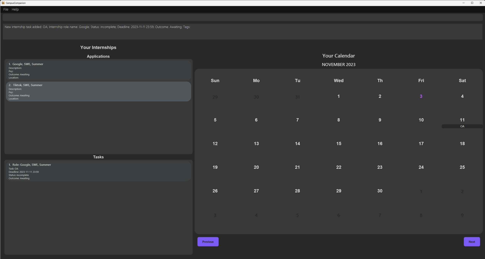
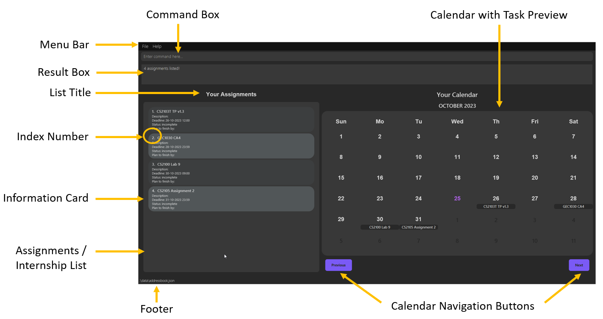

## Welcome to CampusCompanion
**_Organising your university life is just a few keystroke away!_**

CampusCompanion is a **desktop application** built for **NUS Computer Science students** to manage the tracking of 
assignments and internships.

Here's an **overview** of how CampusCompanion can help you streamline the most important tasks that you will 
encounter in your university life. 
- Store and edit information about assignments and internships
- Track the status of these assignments and internships
- Overview of the tasks for the upcoming week and month

--------------------------------------------------------------------------------------------------------------------

## Table of Contents

* Table of Contents
{:toc}

--------------------------------------------------------------------------------------------------------------------

## How to use this guide

### Notations used in this guide

We have various information in different coloured boxes. 

<div class="alert alert-block alert-danger">

These are alerts which you should take note of before using the command. 

</div>

<div class="alert alert-info">

These are additional information that you should take note of before using the command.

</div>

<div class="alert alert-block alert-warning">

These are information about the parameters that we include for your convenience. 

</div>


### New Users

If you are new here, and need help with getting started with our application, visit our 
[Getting Started](#getting-started) guide to onboard onto CampusCompanion smoothly!

After setting up the application, if you are looking for a step-by-step walk-through on the various features 
that CampusCompanion has, [click here](#campuscompanion-tutorial-for-new-users) for a tutorial of CampusCompanion.

If you are looking to understand the different parts of the Graphical User Interface, [click here](#understanding-the-graphical-user-interface-gui)
for a comprehensive look at our GUI. 

If you want a detailed look into each of the features that CampusCompanion has, visit our [features section](#features).

For any other queries that you might have, visit the [FAQ section](#faq) to find the answers to your queries!

### Experienced users

If you have some experience with our application, and would like an overview of the keywords, 
visit our [command summary page](#command-summary) or [parameter summary page](#parameter-summary).

If you want a detailed look into each of the features that CampusCompanion has, visit our [features section](#features).

--------------------------------------------------------------------------------------------------------------------

## Getting Started

1. Ensure you have Java `11` or above installed in your Computer. [Click here](#checking-java-version) to learn how to check your java version 

2. Download the latest `campuscompanion.jar` from [here](https://github.com/AY2324S1-CS2103T-T12-3/tp/releases).

3. Copy the file to the folder you want to use as the _home folder_ for your CampusCompanion.

4. Open a command terminal, `cd` into the folder you put the jar file in, and use the `java -jar CampusCompanion.jar` command to run the application.<br>
   A GUI similar to the below should appear in a few seconds. Note how the app contains some sample data.<br>
   

5. Type the command in the command box and press Enter to execute it. e.g. typing **`help`** and pressing Enter will open the help window.<br>
   Some example commands you can try:

   * `list-a` : Lists all assignments.

   * `list-i` : Lists all internships.

   * `add-a n/CS2100 Assignment 1 e/2023-12-29` : Adds an assignment named `CS2100 Assignment 1` with a deadline of `29 Dec 2023 23:59` to the Campus Companion.

   * `delete-a 3` : Deletes the assignment with index 3 in the current list.

   * `mark-a 1` : Marks the assignment with index 1 in the current list.

   * `exit` : Exits the app.

6. Refer to the [Features](#features) below for details of each command.

[Scroll back to Table of Contents](#table-of-contents)

--------------------------------------------------------------------------------------------------------------------
## Glossary
### Definitions 
Here are some descriptions of the words we use throughout the User Guide:

| Term               | Definition                                                                                                                                                                                                        |
|--------------------|-------------------------------------------------------------------------------------------------------------------------------------------------------------------------------------------------------------------|
| Command            | An input from the user that tells CampusCompanion to perform an action (eg. ADD an assignment, DELETE an assignment).                                                                                             |
| Parameter          | Parameters are the details you would include about the assignment/internship (eg. Name, Description). A command may include 1 or more parameters.                                                                 |
| Required Parameter | These are parameters that **must** be included in the command, otherwise the command will fail, and an error message will be displayed to you.                                                                    |
| Optional Parameter | These are parameters that can be omitted from the command with no errors. Such parameters provides you the flexibility of capturing or omitting additional, less important information.                           |
| GUI                | Graphical User Interface (GUI) represents the visual display of CampusCompanion which you are looking at and interacting with.                                                                                    |
| GUI component      | The GUI is made up of many GUI components such as the calendar component, the list component etc. For more information on specific GUI components, [click here](#understanding-the-graphical-user-interface-gui). |
| CLI                | Command Line Interface (CLI) represents a text-based user interface to interact with the application.                                                                                                             |


[Scroll back to Table of Contents](#table-of-contents)

--------------------------------------------------------------------------------------------------------------------
## Understanding the Graphical User Interface (GUI)

### Quick Orientation



Here is a quick summary of each GUI component within CampusCompanion's assignments view.

| Component                   | Description                                                                                                                                                                                                                                                                              |
|-----------------------------|------------------------------------------------------------------------------------------------------------------------------------------------------------------------------------------------------------------------------------------------------------------------------------------|
| Menu Bar                    | Contains dropdown menu for ``File`` which lets you exit CampusCompanion, and ``Help`` which leads you to this user guide.                                                                                                                                                                |
| Command Box                 | Commands are entered here.                                                                                                                                                                                                                                                               |
| Result Box                  | Feedback from entered command is shown here. If command entered is erroneous, the required correct usage will be shown.                                                                                                                                                                  |
| List Title                  | Indicates if ``Assignments`` or ``Internships`` are currently being shown.                                                                                                                                                                                                               |
| Assignment/Internship List  | Shows all relevant information cards, can be switched between ``Assignments`` and ``Internships`` through the use of the ``list-x`` command, ``x`` being ``a`` or ``i`` respectively. <br><br> When CampusCompanion is first opened, all ``Internship`` information cards will be shown. |
| Information Card            | Shows all information of individual ``assignment`` or ``internship``, these can be filtered through the use of ``list`` or ``find``.                                                                                                                                                     |
| Index Number                | The index number of the card, it is used in commands like ``delete`` and ``edit``.                                                                                                                                                                                                       |
| Calendar with Task Preview  | The calendar shows up to 2 tasks, be it ``assignment`` or ``internship`` for each day, if there are any. The current day is highlighted in purple.                                                                                                                                       |
| Calendar Navigation Buttons | Used to change the month being shown on the calendar.                                                                                                                                                                                                                                    |
| Footer                      | Shows the location of the saved data. This file can be used to move data to another computer.                                                                                                                                                                                            |


Here is a quick summary of the different GUI components within CampusCompanion's internships view.

| Component            | Description                                                                                                  |
|----------------------|--------------------------------------------------------------------------------------------------------------|
| Sub-list Title       | Indicates if ``Internship roles`` or ``Internship tasks`` are being shown in that list                       |
| Internship Role List | Shows all information of individual ``internship role`` that you're applying for.                            |
| Internship Task List | Shows all information of individual ``internship task`` for an ``internship role`` that you're applying for. |

[Scroll back to Table of Contents](#table-of-contents)

### Notes about the GUI

In order to use any `assignment` commands, you must first switch to the assignment view (using `list-a`). Otherwise, you will receive an error message. 

In order to use any `internship` commands, you must first switch to the internship view (using `list-i`). Otherwise, you will receive an error message.

The calendar will only display tasks for the selected month, up to a maximum of 2 for each day. Names that are too long will be truncated.

While there are clickable buttons such as the calendar navigation button and the options on the menu bar, CampusCompanion is a CLI-focused application, and as such, implements commands to do the same thing.
For example:
- ``Help`` can be achieved using the ``help`` command.
- ``File -> Exit`` can be achieved using the ``exit`` command.

[Scroll back to Table of Contents](#table-of-contents)

--------------------------------------------------------------------------------------------------------------------
## Command format

| Format                                                                             | Explanation                                                                  | Examples                                                                                            |
|------------------------------------------------------------------------------------|------------------------------------------------------------------------------|-----------------------------------------------------------------------------------------------------|
| Words in `UPPER_CASE`                                                              | These are parameter values that are supplied by the user                     | `add-a n/NAME...` can be used as `add-a n/CS2103T TP...`                                            |
| Items in square brackets                                                           | These are optional parameters (can be left empty by user)                    | `add-a n/NAME ... [t/TAG]` can be used as `add-a n/CS2103T TP t/milestone2` or `add-a n/CS2103T TP` |
| Items with `…` after them                                                          | These are parameters that can be used multiple times (or omitted completely) | `add-a ... [t/TAG]…` can be used as `add-a ... t/groupProject t/milestone2` or `add-a ...`          |
| Parameters can be in any order.                                                    | N/A                                                                          | `add-a n/NAME e/DEADLINE ...` is equivalent to `add-a e/DEADLINE n/NAME`                            |
| Extraneous parameters for commands that do not take in parameters will be ignored. | N/A                                                                          | `list-i 123` will be equivalent to `list-i`                                                         |

[Scroll back to Table of Contents](#table-of-contents)

--------------------------------------------------------------------------------------------------------------------

## CampusCompanion Tutorial (for new users)

This is a tutorial for new CampusCompanion users. This tutorial will provide you step-by-step instructions for how to use each
command for both assignments and internships. 

1. Launch CampusCompanion. You may refer to the instructions [here](#getting-started).
2. Let's change the view to see assignments first. Enter the command `list-a`

3. Let's try **adding an assignment** to CampusCompanion. Enter the command
`add-a n/CC tutorial 1 e/2023-11-29`


4. Add a few more assignments. Try out filling optional parameters as well, etc
 - `add-a n/CS2100 Assignment 1 e/2023-11-30 13:00 t/Coding`
 - `add-a n/CC optional 1 e/2023-11-29 16:00 d/try this out! s/complete p/2023-11-27 t/Optional`
   - Note: On adding assignments, they will automatically be sorted by their deadlines.
   The assignment due earliest will be first in the assignments list, which can be viewed using `list-a`

   

5. Let us try editing the description of `CC tutorial 1` to say `nice descriptive description!`.
In the example above, `CC tutorial 1` is in index 2, so we do `edit-a i/2 d/nice descriptive description!`


6. We are done with `CC tutorial 1`! Let's now mark it as complete. First, let's try using `find-a` to filter and narrow
down the list. We can do `find-a tutorial` to filter the assignments list to show only assignments that
contain `tutorial`


7. Then, we use the index shown in the list (in this case, `CC tutorial 1` is at index 1) and do `mark-a 1` to mark the assignment as completed


8. To see all our assignments again, let's do `list-a`


9. Lastly for our assignments, let's delete our `CC tutorial 1` as we no longer want to track it.
With reference the picture above, we will do `delete-a 2`


10. Now, let's change the view to see internships. Enter the command `list-i`


11. Similar to assignments, we can add internship roles (under applications) and tasks! Let's add a few roles now using the command `add-i-role`
 - `add-i-role n/Google r/SWE c/Summer 2024`
 - `add-i-role n/FaceBook r/DevOps c/Winter 2024 d/Impress Mr Mark p/9500 o/follow-up l/Florida`


12. Now, let's add in some tasks relating to our roles, with `add-i-task`
 - `add-i-task n/OA i/1  e/2023-11-30 11:30` 
 - `add-i-task n/Interview i/1 e/2023-12-10 16:00 o/follow-up`
 - `add-i-task n/OA i/2 e/2023-11-29 17:30 s/complete o/follow-up`


13. We can also mark tasks as complete with `mark-i` and edit tasks and roles using `edit-i-task` and `edit-i-role` respectively. Let's try!
 - `mark-i 2`
 - `edit-i-task i/1 o/awaiting`
 - `edit-i-role i/1 c/Winter 2024 d/Prepare for google questions p/12500 l/Labrador Park`


14. Lastly, let's find Google with `find-i-role google` and delete the completed Google OA task with `delete-i-task 1`


15. We can view our internships list again with `list-i`


16. Congratulations! You are now ready to use CampusCompanion.

To view all our features, you may visit out [features section](#features).

[Scroll back to Table of Contents](#table-of-contents)

--------------------------------------------------------------------------------------------------------------------
## Features

## Assignment Features

### Adding an assignment

```add-a n/NAME e/YYYY-MM-DD [HH:mm] [d/DESCRIPTION] [s/STATUS] [p/YYYY-MM-DD [HH:mm]] [t/TAG]…```

<div markdown="block" class="alert alert-block alert-warning">

**Parameter Information**

- `n/`: name of the assignment
- `e/`: end date (deadline) of the assignment
- `d/`: description of assignment
- `s/`: complete or incomplete
- `p/`: planned completion date of the assignment
- `t/`: tags for the assignment

To view detailed assignment parameter information, click [here](#assignment-parameters)

</div>

**Purpose:**
To add an assignment into CampusCompanion.

<div markdown="block" class="alert alert-info">

**Note:**
- The start time and end time within the end date (e/) and planned end date (p/) is optional. 
If not provided, start time will default to 00:00 and end time will default to 23:59.
- The planned end date **MUST** be before end date.
</div>

**Examples:** 
- `add-a n/CS2100 Assignment 1 e/2023-11-29 13:00`
- `add-a n/CS2103T v1.3 e/2023-11-28 18:00 d/Work on add function for task s/incomplete p/2023-11-27 16:00 t/Coding`

**When you might use it:** 
- When you first receive news of an assignment or deadline, and you want to keep track of it.
- When you already have existing assignments not written in CampusCompanion, and want to organise them all in one place.

[Scroll back to Table of Contents](#table-of-contents)

### Editing an assignment

```edit-a i/INDEX d/DESCRIPTION```

To view assignment parameter information, click [here](#assignment-parameters)

**Purpose:** Edit the description of a specified assignment to what is specified by `d/`

<div markdown="block" class="alert alert-info">

**Note**
- The index refers to the position of the assignment in the assignment list. To find out 
the index of the assignment you want to edit, use the ``list-a`` command.
</div>

**Examples:**
- Use `list-a` to list all the assignments, followed by `edit-a i/1 d/This is my new description`
to edit the description of the assignment at **index** 1.
- Use `find-a CS2103T` to find the assignment with "CS2103T" in the name. Assuming that this assignment
- is at **index** 1, use `edit-a i/1 d/Create test cases` to edit its description to "Create test cases".

**When you might use it:** 
- If the assignment was originally added with a wrong description.
- If the requirements of the assignment has changed since you last added it.

[Scroll back to Table of Contents](#table-of-contents)

### Deleting an assignment

```delete-a INDEX```

To view assignment parameter information, click [here](#assignment-parameters)

**Purpose:** To delete the specified assignment from CampusCompanion

<div markdown="block" class="alert alert-danger">

**ALERT**

This command cannot be undone. If you remove the wrong assignment, you will have to add it back using ``add-a``.

</div>


<div markdown="block" class="alert alert-info">

**Note:**

- The index refers to the position of the assignment in the assignment list. To find out
  the index of the assignment you want to edit, use the ``list-a`` command.

</div>

**Examples:**
- ``list-a`` to list all the assignments, followed by ``delete-a 1`` to delete assignment with **index** 1.
- ``find-a CS2103T`` to find the assignment you want to delete which has "CS2103T" in the name. Assuming this assignment is at **index** 1,
use ``delete-a 1`` to delete it.

**When you might use it:**
- If the assignment is completed and submitted, and you have no need to continue tracking it. 
- If the assignment is wrongly added.
- If certain details of the assignment was wrongly added, and these details are non-editable (e.g. name of assignment, deadline). 
For information on which details can be edited, [refer here](#editing-an-assignment).

[Scroll back to Table of Contents](#table-of-contents)

### Marking an assignment as complete

```mark-a INDEX```

To view assignment parameter information, click [here](#assignment-parameters)

**Purpose:**
To mark a specific assignment in CampusCompanion as complete.

<div markdown="block" class="alert alert-info">

**Note:**
- The index refers to the index number in the displayed assignments list. If you want to find out the index of the
  assignment you want to mark, you can use ``list-a`` to view all the current assignments you have.
</div>

**Examples:**
- `list-a` to list all the assignments, then `mark-a 1` to mark
the assignment with index 1 as complete.
- `find-a MIH1101` to find assignments with MIH1101 in their name.
Assuming the assignment to mark is at index 1, you can use `mark-a 1` to mark it.

**When you might use it:**
- When you complete an assignment, and you want to mark it.
- When you wrongly unmark a completed assignment, and want to mark it again.

### Marking an assignment as incomplete

```unmark-a INDEX```

To view assignment parameter information, click [here](#assignment-parameters)

**Purpose:**
To mark a specific assignment in CampusCompanion as incomplete.

<div markdown="block" class="alert alert-info">

**Note:**
- The index refers to the index number in the displayed assignments list. If you want to find out the index of the
  assignment you want to unmark, you can use ``list-a`` to view all the current assignments you have.
</div>

**Examples:**
- `list-a` to list all the assignments, then `unmark-a 1` to mark
  the assignment with index 1 as incomplete, assuming it was complete previously.
- `find-a MIH1101` to find assignments with MIH1101 in their name.
  Assuming the assignment to unmark is at index 1 and is complete, 
you can use `unmark-a 1` to mark it as incomplete.

**When you might use it:**
- When you wrongly mark an assignment as complete, and you want to unmark it.
- When you added an assignment with a complete status mistakenly, and want to unmark it.
- When you initially completed an assignment and marked it, but realise you have changes to make 
regarding the assignment and want to continue working on it.

[Scroll back to Table of Contents](#table-of-contents)


### Listing and Filtering assignments

```list-a [s/YYYY-MM-DD [HH:mm]] [e/YYYY-MM-DD [HH:mm]]```

To view assignment parameter information, click [here](#assignment-parameters).

**Purpose:** To list all the assignments with deadline between the given start date and end date.
This command also changes the view to assignments tab (if the view is not currently at the assignments tab).

<div markdown="block" class="alert alert-info">

**Note:**
- In order to use any of the assignment related commands below, you must be in the assignment view. In particular, you must use
  list-a to switch to assignment view. This is to prevent you from performing commands while you are not looking at the correct list.
- The start time and end time is optional. If not provided, start time will default to 00:00 and end time will default to 23:59.
</div>

**Examples:**

| Combination                                                                                                           | Example                                          | What is displayed to you                                                          |
|-----------------------------------------------------------------------------------------------------------------------|--------------------------------------------------|-----------------------------------------------------------------------------------|
| **None** present                                                                                                      | ``list-a``                                       | **All** assignments that are saved in CampusCompanion.                            |
| **Only** _start date with time_ present                                                                               | ``list-a s/2023-12-10 18:00``                    | **All** assignments with deadline **later** than or equal 10 Dec 2023 18:00       |
| **Only** _start date without time_ present                                                                            | ``list-a s/2023-12-10``                          | **All** assignments with deadline **later** than or equal 10 Dec 2023 00:00       |
| **Only** _end date with time_ present                                                                                 | ``list-a e/2023-12-10 18:00``                    | **All** assignments with deadline **earlier** than or equal to 10 Dec 2023 18:00  |
| **Only** _end date without time_ present                                                                              | ``list-a e/2023-12-10``                          | **All** assignments with deadline **earlier** than or equal to 10 Dec 2023 23:59  |
| **Both** _start date_ and _end date_ present (Example not shown for this combination without timing, but it is valid) | ``list-a s/2023-12-10 18:00 e/2023-12-17 18:00`` | **All** assignments with deadline between 10 Dec 2023 18:00 and 17 Dec 2023 18:00 |

**When you might use it**:
- If you want to see all your current assignments.
- If you want to filter your current assignments by date, and view the assignments only within a specified time frame.

[Scroll back to Table of Contents](#table-of-contents)

### Finding an assignment by keywords

```find-a KEYWORD```

**Purpose:**
To find all assignments whose name contains the keyword.

<div markdown="block" class="alert alert-info">

**Note:**
The keyword is case-insensitive and does not require the whole word to match, for example, 
if you had an assignment with the name "CS2100 Lab", using the command ``find-a l``, ``find-a la``, ``find-a lab`` or ``find-a LAB`` 
are all equivalent and will match with this assignment

</div>

**Examples:** 
- ``find-a CS2103T`` to find all assignments with "CS2103T" in the assignment name

**When you might use it:**
- If you are looking for specific assignments within a large pool of assignments and
  want to filter them based on keywords or partial keywords. 

- If you want to find information about specific assignments, but you don't remember their exact names.

- When you need to prioritize your work or plan your schedule, this can allow you to focus on specific tasks or projects.

[Scroll back to Table of Contents](#table-of-contents)

## Internship Features

### Common internship features

#### Listing all internship information

``list-i``

**Purpose:** To list all the internship information stored in CampusCompanion.
This command also changes the view to internships tab (if the view is not currently at the internships tab).


<div markdown="block" class="alert alert-info">

**Note:**

- In order to use any of the internship related commands, you must be in the internship view. Ie, you must use 
list-i to switch to internship view. This is to prevent you from performing commands while you are not looking at the correct list.

</div>

**When you might use it**:
- If you want to see all your current internships.
- If you want to switch from assignment view to internship view. 

[Scroll back to Table of Contents](#table-of-contents)

### Internship Role 

#### Adding an internship role

```add-i-role n/NAME OF COMPANY r/ROLE NAME c/INTERNSHIP CYCLE [d/DESCRIPTION] [p/PAY] [o/OUTCOME] [l/LOCATION] [t/TAG]…```

<div markdown="block" class="alert alert-block alert-warning">

**Parameter Information**

- `n/`: name of the company you are applying/applied to
- `r/`: name of the role you are applying/applied for
- `c/`: cycle of the internship role
- `d/`: description of internship role
- `p/`: expected pay of the internship
- `o/`: outcome of the internship application for that role. To see more information about `outcome` parameter, [click here](#how-to-use-the-internship-outcome)
- `l/`: location of the internship role

To view detailed internship role parameter information, click [here](#internship-role-parameters)

</div>


**Purpose:**
To add an internship role into CampusCompanion. 

**Examples:**
- `add-i-role n/Google r/Software Engineer c/Winter 2024`
- `add-i-role n/TikTok r/Backend Engineer c/Summer 2024 d/Very important internship p/2000 o/awaiting l/remote`

**When you might use it:**
- After you first applied for an internship position, and you want to keep track of it.
- When you already have existing internship applications not written in CampusCompanion, and want to organise them all in one place.

[Scroll back to Table of Contents](#table-of-contents)

#### Editing an internship role

```edit-i-role i/INDEX [c/CYCLE] [d/DESCRIPTION] [p/PAY] [o/OUTCOME] [l/LOCATION]```

To view internship role parameter information, click [here](#internship-role-parameters)

**Purpose:** Edit the specified parameters of a specified internship role.

**Examples:**
- Use `list-i` to list all the internship information, followed by `edit-i-role i/1 o/rejected`
  to edit the outcome of the internship role at **index** 1.
- Use `find-i-role Google` to find the internship information with "Google" in the name. Assuming that this internship role
- is at **index** 1, use `edit-i-role i/1 o/rejected` to edit its outcome to "rejected".

**When you might use it:**
- Once you have an update about the overall outcome of an existing application in CampusCompanion. 
- If you imported old internship application information, and want to update the current outcome of that application.

[Scroll back to Table of Contents](#table-of-contents)

#### Deleting an internship role 

```delete-i-role INDEX```

To view internship role parameter information, click [here](#internship-role-parameters)

**Purpose:** To delete the specified internship role from CampusCompanion

<div markdown="block" class="alert alert-danger">

**ALERT**
- This command will remove both the internship role **and** all its associated tasks.
- This command cannot be undone. If you remove the wrong internship role, you will have to add the role back using ``add-i-role`` and 
all its associated tasks using ``add-i-task``.

</div>

<div markdown="block" class="alert alert-info">

**Note:**

- The index refers to the index number in the displayed internship role list. If you want to find out the index of the
  internship role you want to delete, you can use ``list-i`` to view all the current internship roles you have.

</div>

**Examples:**
- ``list-i`` to list all the internship roles, followed by ``delete-i-role 1`` to delete internship role with **index** 1 **and** all its associated tasks.
- ``find-i-role Google`` to find the internship role you want to delete which has "Google" in the company name. Assuming this internship role is at **index** 1,
  use ``delete-i-role 1`` to delete it **and** all its associated tasks.

**When you might use it:**
- If the internship selection process is completed, and you have no need to continue tracking it.
- If the internship role is wrongly added.
- If certain details of the internship role was wrongly added, and these details are non-editable (e.g. name of company, name of role).
  For information on which details can be edited, [refer here](#editing-an-internship-role).

[Scroll back to Table of Contents](#table-of-contents)

#### Finding an internship role by keywords

```find-i-role KEYWORD```

To view internship role parameter information, click [here](#internship-role-parameters)

**Purpose:**
To find all internship role and their associated tasks whose **company** name contains the keyword provided.

<div markdown="block" class="alert alert-info">

**Note:**
The keyword is case-insensitive and does not require the whole word to match, 
for example, if you had an internship role with the name "TikTok", using the command 
``find-i-role tiktok`` or ``find-i-role tik`` will match with this internship role

</div>

**Examples:**
- ``find-i-role TikTok`` to find all internship information with "TikTok" in the company name

**When you might use it:**
- If you are looking for specific internship information within a long list of internships and
  want to filter them based on keywords or partial keywords.

- If you want to find information about specific internship role, but you don't remember the company's exact name.

[Scroll back to Table of Contents](#table-of-contents)

### Internship Task

#### Adding an internship task

```add-i-task n/NAME i/INDEX OF INTERNSHIP ROLE e/YYYY-MM-DD [HH:mm] [s/STATUS] [o/OUTCOME] [t/TAG]…```

<div markdown="block" class="alert alert-block alert-warning">

**Parameter Information**

- `n/`: name of the task
- `i/`: internship role that is associated to the task 
- `e/`: end date (deadline) for the task
- `s/`: complete or incomplete
- `o/`: outcome of the internship application for that role. To see more information about `outcome` parameter, [click here](#how-to-use-the-internship-outcome)
- `t/`: tags for the internship task

To view detailed internship task parameter information, click [here](#internship-task-parameters)

</div>

**Purpose:**
To add an internship task, associated to an internship role into CampusCompanion.

**Examples:**
- `add-i-task i/1 n/Tiktok OA e/2023-12-29 13:00`
- `add-i-task i/1 n/Google Behavioural interview e/2023-12-28 s/incomplete o/awaiting t/Video`

**When you might use it:**
- When you first receive news of a new task related to your internship role, and you want to keep track of it.

[Scroll back to Table of Contents](#table-of-contents)

#### Editing an internship task

```edit-i-task i/INDEX o/OUTCOME```

To view internship task parameter information, click [here](#internship-task-parameters)

**Purpose:** Edit the outcome of a specified internship task

**Examples:**
- Use `list-i` to list all the internship information, followed by `edit-i-task i/1 o/rejected`
  to edit the outcome of the internship task at **index** 1.
- Use `find-i-task OA` to find the internship task with "OA" in the task name. Assuming that this internship task
is at **index** 1, use `edit-i-task i/1 o/rejected` to edit its outcome to rejected.

**When you might use it:**
- Once you have an update about the overall outcome of an existing application in CampusCompanion.
- If you imported old internship application information, and want to update the current outcome of that application.

[Scroll back to Table of Contents](#table-of-contents)

#### Deleting an internship task

```delete-i-task INDEX```

To view internship task parameter information, click [here](#internship-task-parameters)

**Purpose:** To delete the specified internship task from CampusCompanion

<div markdown="block" class="alert alert-danger">

**ALERT**
This command cannot be undone. If you remove the wrong internship task, you will have to add it back using ``add-i-task``.

</div>

<div markdown="block" class="alert alert-info">

**Note:**

- The index refers to the index number in the displayed internship task list. If you want to find out the index of the
  internship task you want to delete, you can use ``list-i`` to view all the current internship tasks you have.

</div>

**Examples:**
- ``list-i`` to list all the internships, followed by ``delete-i-task 1`` to delete internship task with **index** 1.
- ``find-i-task OA`` to find the internship task you want to delete which has "OA" in the name. Assuming this task is at **index** 1,
  use ``delete-i-task 1`` to delete it.

**When you might use it:**
- If the internship task is completed and submitted, and you have no need to continue tracking it.
- If the internship task is wrongly added.

[Scroll back to Table of Contents](#table-of-contents)

#### Marking an internship task as complete

```mark-i INDEX```

**Purpose:**
To mark a specific internship task in CampusCompanion as complete.

<div markdown="block" class="alert alert-info">

**Note:**
- The index refers to the index number in the displayed internship list. If you want to find out the index of the
  internship task you want to mark, you can use ``list-i`` to view all the current internship tasks you have.
-  If an internship task is wrongly marked as complete, you can unmark it with `unmark-i`.
</div>

**Examples:**
- `list-i` to list all the internship tasks, then `mark-i 1` to mark
  the internship task with index 1 as complete.
- `find-i-task OA` to find internship task with OA in their name.
  Assuming the internship task to mark is at index 1, you can use `mark-i 1` to mark it.

**When you might use it:**
- When you complete an internship task, and you want to mark it.
- When you wrongly unmark a completed internship task, and want to mark it again.

#### Marking an internship task as incomplete

```unmark-i INDEX```

**Purpose:**
To mark a specific internship task in CampusCompanion as incomplete.
<div markdown="block" class="alert alert-info">

**Note:**
- The index refers to the index number in the displayed internship task list. If you want to find out the index of the
  internship task you want to unmark, you can use ``list-i`` to view all the current internship tasks you have.
- If a completed internship task is wrongly marked as incomplete, you can mark it again with `mark-i`.
</div>

**Examples:**
- `list-i` to list all the internship tasks, then `unmark-i 1` to unmark
  the internship task with index 1 as incomplete.
- `find-i-task OA` to find internship task with OA in their name.
  Assuming the internship task to unmark is at index 1, you can use `unmark-i 1` to unmark it.

**When you might use it:**
- When you wrongly mark an incomplete internship task, and want to unmark it.
- When you wrongly add an internship task with the status as complete.

[Scroll back to Table of Contents](#table-of-contents)

#### Finding an internship task by keywords

```find-i-task KEYWORD```

**Purpose:**
To find all internship tasks whose name contains the keyword. This will also display all the internship role associated to the tasks.

<div markdown="block" class="alert alert-info">

**Note:**
The keyword is case-insensitive and does not require the whole word to match, for example, 
if you had an internship task with the name "interview 1", using the command ``find-i-task INTERVIEW`` or ``find-i-task inter``
will match with this internship task.

</div>

**Examples:**
- ``find-i-task interview`` to find all internship tasks with "interview" in the task name, and the associated internship role.

**When you might use it:**
- If you are looking for specific internship task information within a long list of internships and
  want to filter them based on keywords or partial keywords.

- If you want to find information about specific internship task, but you don't remember the task's exact name.

[Scroll back to Table of Contents](#table-of-contents)

## General Commands

### Exiting the program

``exit``

**Purpose:** Exits the program.

[Scroll back to Table of Contents](#table-of-contents)

### Viewing help

``help``

**Purpose:** Shows a message explaining how to access the help page, which is the CampusCompanion User Guide. 

**When you might use it**
- If you have forgotten what is the structure for a certain command and its parameters.
- If you keep receiving error messages after entering commands, and are unsure why. 
- If you are unsure of what are the commands that are available to you in CampusCompanion. 

[Scroll back to Table of Contents](#table-of-contents)

## Data Related Features

### Saving the data

CampusCompanion data are saved in the hard disk automatically after any command that changes the data. There is no need to save manually.

[Scroll back to Table of Contents](#table-of-contents)

### Editing the data file

CampusCompanion data are saved automatically as a JSON file `[JAR file location]/data/campuscompanion.json`. 

Advanced users are welcome to update data directly by editing that data file. After editing that file, 
when you re-run the application, the new data will automatically be shown. 

<div markdown="block" class="alert alert-info">

**Note:**
We do not recommend editing the file directly, because if the data is entered in the wrong format, it would corrupt the
application, and the application may not be able to load subsequently.

</div>


[Scroll back to Table of Contents](#table-of-contents)

--------------------------------------------------------------------------------------------------------------------
## Command Summary

This section provides a summary of the **commands**. 

<div markdown="block" class="alert alert-info">

**Note:**
Each command may require 1 or more compulsory parameters.
Please refer to [parameter summary](#parameter-summary) section, for more information on each parameter,
or [feature](#features) section, for detailed information about each feature.

</div>

[Scroll back to Table of Contents](#table-of-contents)

### Assignment Commands

| Command  | What it does                                                                                                                                                   |
|----------|----------------------------------------------------------------------------------------------------------------------------------------------------------------|
| add-a    | Adds an assignment into CampusCompanion                                                                                                                        |
| edit-a   | Edits the existing information of the specified assignment                                                                                                     |
| delete-a | Deletes the specified assignment from CampusCompanion                                                                                                          |
| mark-a   | Changes the status of the specified assignment to completed                                                                                                    |
| unmark-a | Changes the status of the specified assignment to incomplete                                                                                                   |
| list-a   | Changes the view to assignments tab (if the view is not already at the assignments tab), and lists the assignments with deadline within a specified time frame |
| find-a   | Lists the assignments with name matching the given keyword                                                                                                     |

[Scroll back to Table of Contents](#table-of-contents)

### Internship Commands

#### Common Internship Commands

| Command | What it does                                                                                                                          |
|---------|---------------------------------------------------------------------------------------------------------------------------------------|
| list-i  | Changes the view to internships tab (if the view is not already at the internships tab), and lists all stored internship information  |

[Scroll back to Table of Contents](#table-of-contents)

#### Internship Role Commands 

| Command       | What it does                                                                                         |
|---------------|------------------------------------------------------------------------------------------------------|
| add-i-role    | Adds an internship role into CampusCompanion                                                         |
| edit-i-role   | Edit the specified parameters of a specified internship role.                                        |
| delete-i-role | Deletes the specified internship role and all its associated tasks from CampusCompanion              |
| find-i-role   | Lists the internship role with company name matching the given keyword, and all the associated tasks |

[Scroll back to Table of Contents](#table-of-contents)

#### Internship Task Commands

| Command       | What it does                                                                            |
|---------------|-----------------------------------------------------------------------------------------|
| add-i-task    | Adds an internship task, associated to an existing internship role into CampusCompanion |
| edit-i-task   | Edits the current outcome information of the specified internship task                  |
| delete-i-task | Deletes the specified internship task from CampusCompanion                              |
| mark-i        | Changes the status of the specified internship task to completed                        |
| unmark-i      | Changes the status of the specified internship task to incomplete                       |
| find-i-task   | Lists the internship task with name matching the given keyword, and its associated role |

[Scroll back to Table of Contents](#table-of-contents)

--------------------------------------------------------------------------------------------------------------------
## Parameter Summary

[Scroll back to Table of Contents](#table-of-contents)

### Assignment Parameters

The information below specifies parameter description, constraints and usage through valid and invalid examples.

| Parameter | Command                                    | Description                                                                         | Constraints                                                                                                                             | Valid Examples                          | Invalid Examples          |
|-----------|--------------------------------------------|-------------------------------------------------------------------------------------|-----------------------------------------------------------------------------------------------------------------------------------------|-----------------------------------------|---------------------------|
| n/        | `add-a`                                    | Name of the assignment                                                              | NA                                                                                                                                      | CS2100 Assignment, Tutorial 2           | NA                        |
| e/        | `add-a`                                    | Deadline of the assignment                                                          | Has to be in YYYY-MM-DD HH:mm format, HH:mm is optional, and set as 23:59 by default<br/> Date inputted **MUST be after current date.** | 2023-12-12, 2023-12-10 15:00            | 12-12-2023, 30/12/2023    |
| d/        | `add-a`                                    | Description of the assignment (optional parameter)                                  | NA                                                                                                                                      | Complete UML diagram, Finish question 2 | NA                        |
| s/        | `add-a`                                    | Status (optional parameter)                                                         | Either `complete` or `incomplete`                                                                                                       | complete, incomplete                    | done, finished, completed |
| p/        | `add-a`                                    | Planned finish date of assignment (optional parameter)                              | Has to be in YYYY-MM-DD HH:mm format, HH:mm is optional, and set as 23:59 by default<br/> Date inputted **MUST be after current date.** | 2023-12-12, 2023-12-10 15:00            | 12-12-2023, 30/12/2023    |
| t/        | `add-a`                                    | Tag for the assignment created                                                      | One word only with no space in between                                                                                                  | Assignment, 1                           | Group work                |
| i/        | `edit-a`, `delete-a`, `mark-a`, `unmark-a` | Index in assignments list                                                           | Positive integer less than or equal to 2147483649                                                                                       | 1, 2147483647                           | -1, 2147483649            |
| s/        | `list-a`                                   | Start date to filter assignments with deadlines after the date (optional parameter) | Has to be in YYYY-MM-DD HH:mm format, HH:mm is optional, and set as 00:00 by default<br/> Date inputted **MUST be after current date.** | 2023-12-12, 2023-12-10 15:00            | 12-12-2023, 30/12/2023    |
| e/        | `list-a`                                   | End date to filter assignments with deadlines before the date (optional parameter)  | Has to be in YYYY-MM-DD HH:mm format, HH:mm is optional, and set as 23:59 by default<br/> Date inputted **MUST be after start date.**   | 2023-12-12, 2023-12-10 15:00            | 12-12-2023, 30/12/2023    |

[Scroll back to assignment features](#assignment-features)

[Scroll back to Table of Contents](#table-of-contents)

### Internship Parameters

#### Internship Role Parameters 

The information below specifies parameter description, constraints and usage through valid and invalid examples.

| Parameter | Command                        | Description                                                                        | Constraints                                                                                                                                                               | Valid Examples                                        | Invalid Examples   |
|-----------|--------------------------------|------------------------------------------------------------------------------------|---------------------------------------------------------------------------------------------------------------------------------------------------------------------------|-------------------------------------------------------|--------------------|
| n/        | `add-i-role`                   | Name of the company you are applying to                                            | NA                                                                                                                                                                        | Google, Tiktok                                        | NA                 |
| r/        | `add-i-role`                   | Name of the role you are applying for                                              | NA                                                                                                                                                                        | Software Engineer, Backend Engineer                   | NA                 |
| c/        | `add-i-role`                   | Cycle of the internship you are applying for                                       | NA                                                                                                                                                                        | Winter 2023, Summer 2024, Spring                      | NA                 |
| d/        | `add-i-role`                   | Description of the internship role (optional parameter)                            | NA                                                                                                                                                                        | Very important internship                             | NA                 |
| p/        | `add-i-role`                   | Pay of the internship role (optional parameter)                                    | Only numbers with up to one decimal point allowed. Must be a non-negative number. Input will be formatted to 2 decimal places, longer inputs will be truncated as needed. | 1000, 1000.00, 1000.000000 (will be shown as 1000.00) | $1000, -1, -0      |
| o/        | `add-i-role`, `edit-i-role`    | Outcome of the internship role application (optional parameter - for `add-i-role`) | `follow-up`, `ghosted`, `rejected`, `offered`, `accepted`, `awaiting` only (case sensitive)                                                                               | offered, accepted                                     | REJECTED, no reply |
| l/        | `add-i-role`                   | Location of the internship role (optional parameter)                               | NA                                                                                                                                                                        | Singapore, remote                                     | NA                 |
| i/        | `edit-i-role`, `delete-i-role` | Index in internship role list                                                      | Positive integer less than or equal to 2147483649                                                                                                                         | 1, 2147483647                                         | -1, 2147483649     |

[Scroll back to Internship Role features](#internship-role)

[Scroll back to Table of Contents](#table-of-contents)

#### Internship Task Parameters

The information below specifies parameter description, constraints and usage through valid and invalid examples.

| Parameter | Command                        | Description                                                            | Constraints                                                                                                                             | Valid Examples               | Invalid Examples          |
|-----------|--------------------------------|------------------------------------------------------------------------|-----------------------------------------------------------------------------------------------------------------------------------------|------------------------------|---------------------------|
| n/        | `add-i-task`                   | Name of the task you have to complete                                  | NA                                                                                                                                      | Google, Tiktok               | NA                        |
| i/        | `add-i-task`                   | Index of the internship role, which is associated to this task         | Positive integer less than or equal to 2147483649                                                                                       | 1, 2147483647                | -1, 2147483649            |
| e/        | `add-i-task`                   | Deadline of the internship task                                        | Has to be in YYYY-MM-DD HH:mm format, HH:mm is optional, and set as 23:59 by default<br/> Date inputted **MUST be after current date.** | 2023-12-12, 2023-12-10 15:00 | 12-12-2023, 30/12/2023    |
| s/        | `add-i-task`                   | Status of the internship task (optional parameter)                     | Either `complete` or `incomplete`                                                                                                       | complete, incomplete         | done, finished, completed |
| o/        | `add-i-task`, `edit-i-task`    | Outcome of the internship task (optional parameter - for `add-i-task`) | `follow-up`, `ghosted`, `rejected`, `offered`, `accepted`, `awaiting` only (case sensitive)                                             | offered, accepted            | REJECTED, no reply        |
| t/        | `add-i-task`                   | Tag for the internship task (optional parameter)                       | One word only with no space in between                                                                                                  | Assignment, 1                | Group work                |
| l/        | `add-i-task`                   | Location (optional parameter)                                          | NA                                                                                                                                      | Singapore, remote            | NA                        |
| i/        | `add-i-task`                   | Index in internship **role** list                                      | Positive integer less than or equal to 2147483649                                                                                       | 1, 2147483647                | -1, 2147483649            |
| i/        | `edit-i-task`, `delete-i-task` | Index in internship **task** list                                      | Positive integer less than or equal to 2147483649                                                                                       | 1, 2147483647                | -1, 2147483649            |


[Scroll back to Internship Task features](#internship-task)

[Scroll back to Table of Contents](#table-of-contents)

--------------------------------------------------------------------------------------------------------------------

## FAQ

### Launching CampusCompanion
**Q**: How can I launch CampusCompanion if the clicking on the JAR file does not work?
**A**: There are two possible methods to launch CampusCompanion.

Method 1: For users familiar with the command prompt
1. Open the command prompt
2. Navigate to the directory where the JAR file is located using `cd [JAR file location]`
3. Type `java -jar campusCompanion.jar` and press enter
4. CampusCompanion should launch

Method 2: For users that wish to create a script to launch CampusCompanion (**Recommended**)
1. Create a new text file
2. Copy and paste the following into the text file:
```
java -jar [JAR file location]/campusCompanion.jar
```
3. Save the text file as `campusCompanion.bat` (Windows) or `campusCompanion.sh` (MacOS/Linux)
4. Change the admin settings of the script to allow it to run as a program:
  1. Windows: Right-click on the script and select `Properties`. Under `General`, check the box that says `Allow this file to run as a program`.
  2. MacOS/Linux: Open the terminal and navigate to the directory where the script is located. Type `chmod +x [script name]` and press enter. (`chmod +x` changes permissions of the script to allow it to be executed.)
5. Double-click on the script to launch CampusCompanion
6. CampusCompanion should launch

[Scroll back to Table of Contents](#table-of-contents)

### Checking Java version
**Q**: How can I check my Java version?<br>
**A**: Open a command prompt and type `java -version`. If you do not have Java installed, you can download it [here](https://www.oracle.com/java/technologies/javase-jdk11-downloads.html).

For Mac Users you may wish to follow the instructions listed [here](https://nus-cs2103-ay2324s1.github.io/website/admin/programmingLanguages.html)

**Q**: How do I transfer my data to another Computer?<br>
**A**: Install the app in the other computer and overwrite the empty data file it creates with the file that contains the data of your previous Campus Companion home folder.

[Scroll back to Table of Contents](#table-of-contents)

### How to use the internship outcome
**Q**: What is the recommended usage of the internship outcomes 
**A**: Outcome must be either one of the following only: `follow-up`, `ghosted`, `rejected`, `offered`, `accepted`, `awaiting`. This is how we recommend using them: 
- Awaiting (Just finished with one stage and awaiting results of that stage)
- follow-up (Just received a follow-up - e.g. for an interview, but haven't finished that round yet.
  Once finished with that round, the status should be updated to awaiting to indicate that you are awaiting results.)
- Ghosted (If you did not receive any news after an appropriate amount of time.)
- Rejected (If you received a rejection letter)
- Offered (If you are offered the internship)

[Scroll back to Internship Features](#internship-features)

[Scroll back to Table of Contents](#table-of-contents)

--------------------------------------------------------------------------------------------------------------------

## Known issues

1. **When using multiple screens**, if you move the application to a secondary screen, and later 
switch to using only the primary screen, the GUI will open off-screen. The remedy is to delete the 
`preferences.json` file created by the application before running the application again.

[Scroll back to Table of Contents](#table-of-contents)
